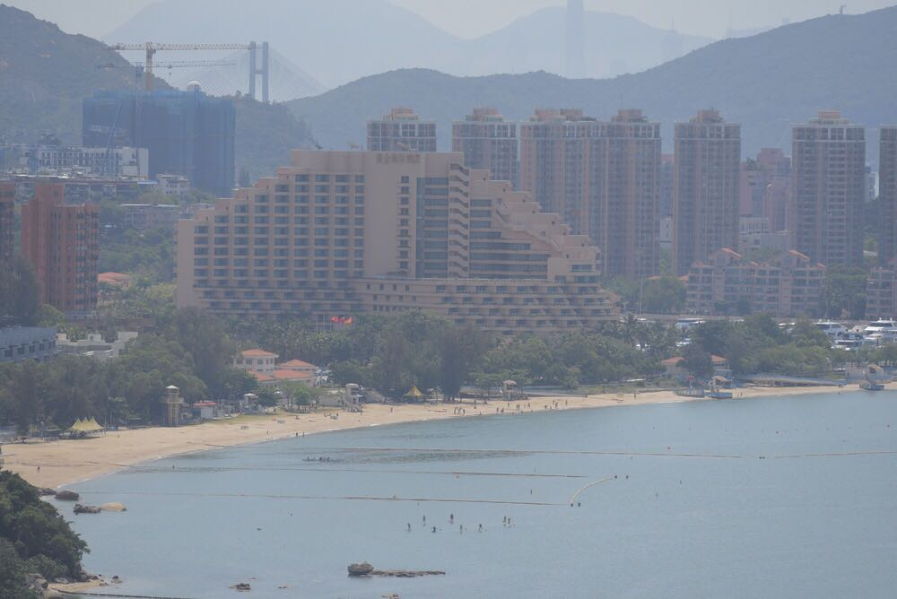
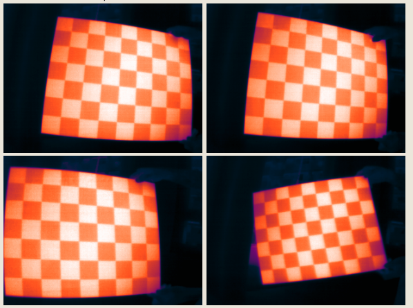
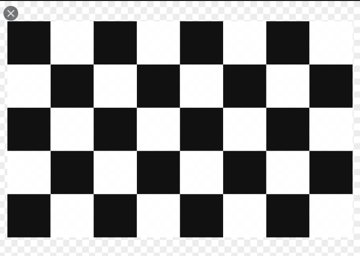
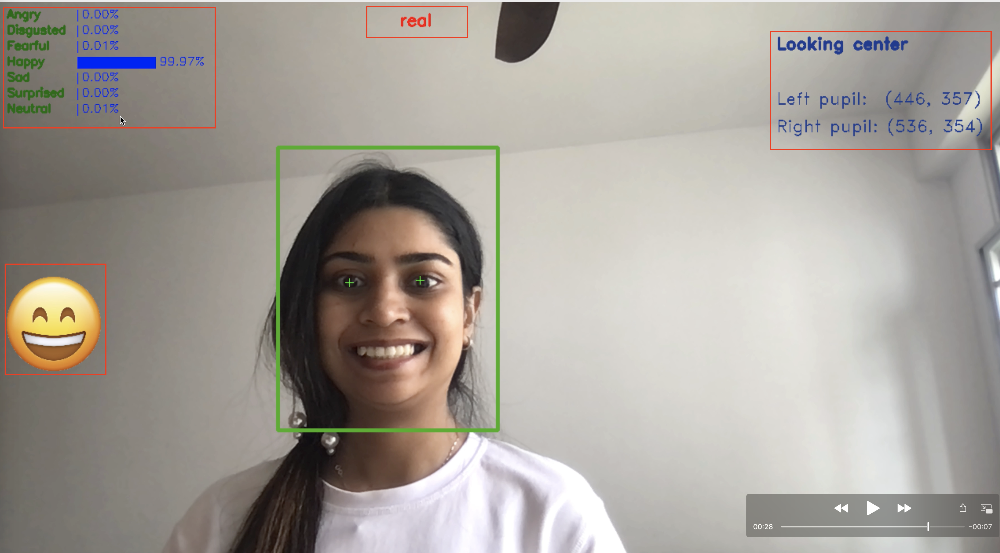

YOZO-Games
========

This git repository contains solution for each of the problems from YOZO games. 

Install
-------

    $ pip install -r requirements.txt

    
Problem 1.1
----

Find a suitable way to transform image1 to image 2 

(hints: contrast and transformation)

Image 1             |  Image 2
:-------------------------:|:-------------------------:
  |  

I think the possible transformation used for getting image2 from image 1 are as follow

    1. Contrast Enhancement 
    2. Perspective Correction/Transformation
    3. Cropping/Zooming

This is jupyter notebook [notebook](problem1.1/transformation.ipynb) for solution of this problem.

Problem 1.2
-------------------------

The following images are produced by a thermal camera, please find an appropriate way to eliminate the distortion created by the camera.

 

To remove the distortion for these images created by thermal camera we need to do perspective correction for each of them.

#### Perspective Correction
In perspective correction a source image is transformed into a desired perspective view by computing the homography that maps the source points into the desired points. 

In this example, all the images are captured by a thermal camera and distorted. So we need a reference checkerboard image and need to transform each of the example images using homography.
 
I have used a reference checkerboard as the following image. Then find corners from both input and reference checkerboard images using OpenCV findChessboardCorners(). Find homography using corners detected from both of the images and finally use wrapPerspective() to map the input_image to the reference images. 

 

------
    ret1, corners_inp = cv.findChessboardCorners(input_image, patternSize)
    ret2, corners_ref = cv.findChessboardCorners(ref_image, patternSize)
    
    H, _ = cv.findHomography(corners_inp, corners_ref)
    
    input_image_warp = cv.warpPerspective(input_image, H, (input_image.shape[1], input_image.shape[0]))

This is a jupyter notebook [notebook](problem1.2/perspective%20transformation.ipynb) for solution of this problem.

Problem 2
-----------------------------------------
Develop a system that can track eye gaze, emotion, and faces from a video source near real time. The system should distinguish between real faces and faces from photos.  

##### Tasks and requirements:
* Based on existing techniques, build a system that can track eye gaze and human facial emotion.
* Backend will take the webcam or integrated camera from laptop as input source.
* Backend should be able to handle the detection task while displaying the video source from the frontend.
* Backend should be able to handle eye gaze tracking showing where the eyes are focusing on the screen in the frontend.
* Emotions should include at least 6 out of Neutral, Anger, Surprise, Sleepy, Boredom, Fearful, Distressed, Frustration, Happy, Excited, Sadness, Relax.
* Frontend should show detected face(s), expressions, and detected emotions clearly.
* Frontend should distinguish between a real face and face from a photo.
* Accuracy is not main consideration for this task.

##### Solution
Problem 2 needs multiple AI models. Basically we need models for
* `Eye Gaze Detection and Tracking`
* `Emotion Detection` (classification Model)
* `Liveliness Detection` (Classification Model)

For each of the above models, the base task is face detection. Once we detect a face we can pass it to each of the downstream task. So we can use a single model for face detection and pass it to each of the downstream task.
There are a lot of open source model for face detection (`MTCNN`, `RetinaFace` etc.) with a good accuracy. For the simplicity of the project and to run the system in near real time using laptop camera I used face detection using `Haar Cascades` from opencv. 

##### Demo

    $ cd problem2
    $ python main.py

Following section describe details of each of the models 
#### Face Liveness Detection using Depth Map Prediction
This is an application of a combination of Convolutional Neural Networks and Computer Vision to detect
between actual faces and fake faces in realtime environment. The image frame captured from webcam is passed over a pre-trained model. This model is trained on the depth map of images in the dataset. The depth map generation have been developed from a different CNN model.

##### The Convolutional Neural Network

The network consists of **3** hidden conlvolutional layers with **relu** as the activation function. Finally it has **1** fully connected layer.

The network is trained with **10** epochs size with batch size **32**

The ratio of training to testing bifuracation is **75:25**

#### Realtime Face Emotion Detection

Realtime Human Emotion Analysis From facial expressions. It uses a deep Convolutional Neural Network. The model used achieved an accuracy of 83% on the test data. The realtime analyzer assigns a suitable emoji for the current emotion.
### Emojis/Emotion used:
      

Copyright
---------

See the LICENSE for details.
